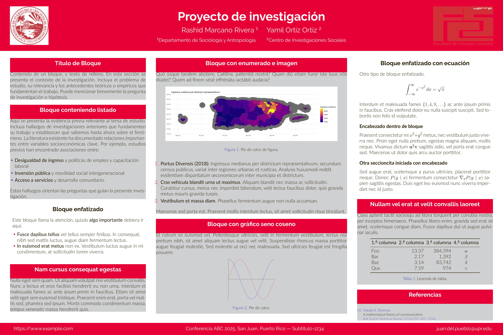

# Gemini UPR-RP FCS

Adaptación no oficial del tema [Gemini][gemini] de [beamerposter] para la Facultad de Ciencias Sociales de la Universidad de Puerto Rico, Recinto de Río Piedras.

<p align="center">

</p>

## Características

* Colores institucionales de la UPR-RP y la Facultad de Ciencias Sociales
* Espacios predefinidos para logos institucionales
* Texto de ejemplo en español con guías para cada sección
* Tamaño de póster estándar (36" × 24")

## Dependencias

* Una instalación de TeX que incluya [LuaTeX] o pdfLaTeX
    * `latexmk` es necesario si desea usar el `Makefile` incluido
* Paquetes de LaTeX incluyendo beamerposter (normalmente incluidos en su instalación de TeX, disponibles en [CTAN] si no)
* Fuentes [Raleway] y [Lato], ambas disponibles bajo Open Font License

## Uso

1. Clone o descargue los archivos de este repositorio
2. Configure `poster.tex` con el tamaño de papel, distribución de columnas y escala deseados
3. Reemplace los logos en la carpeta `logos/` con los logos correspondientes a su departamento o facultad
4. Modifique el contenido de cada bloque según su investigación
5. Compile con `make` o directamente con `pdflatex poster.tex`

## Estructura del proyecto

```
.
├── poster.tex              # Archivo principal
├── beamerthemegemini.sty   # Tema base Gemini
├── beamercolorthemeUPRRP.sty  # Colores UPR-RP FCS
├── logos/                  # Logos institucionales
│   ├── Logo_FCS_UPRRP.png
│   └── el logo.png
├── imagenes/               # Imágenes para el póster
└── poster.bib              # Referencias bibliográficas
```

## Personalización

### Colores

El tema `UPRRP` incluye los colores institucionales. Puede modificarlos en `beamercolorthemeUPRRP.sty` o crear su propio tema de color.

### Tamaño del póster

El tamaño predeterminado es 91.44 cm × 60.96 cm (36" × 24"). Para modificarlo, ajuste la línea en `poster.tex`:

```latex
\usepackage[size=custom,width=91.44,height=60.96,scale=1.0]{beamerposter}
```

### Columnas

La plantilla usa tres columnas: dos laterales estrechas y una central más ancha. Puede ajustar las proporciones modificando:

```latex
\setlength{\colwidth}{0.27\paperwidth}        % Columnas laterales
\setlength{\centralcolwidth}{0.38\paperwidth} % Columna central
```

## Tipos de bloques

La plantilla incluye varios tipos de bloques:

| Bloque | Uso sugerido |
|--------|--------------|
| `block` | Contenido general, texto, metodología |
| `alertblock` | Hallazgos importantes, advertencias |
| `exampleblock` | Ejemplos, ecuaciones destacadas |

## Créditos

Esta plantilla es una adaptación de:

* [Gemini](https://github.com/anishathalye/gemini) por Anish Athalye
* [Gemini Oxford](https://github.com/andiac/gemini-cam) - versión para University of Oxford

Adaptación para UPR-RP FCS por Rashid CJ Marcano Rivera.

## Licencia

Copyright (c) 2018-2022 Anish Athalye (tema Gemini original).

Adaptación para UPR-RP FCS liberada bajo la licencia MIT. Ver [LICENSE.md](LICENSE.md) para más detalles.

[gemini]: https://github.com/anishathalye/gemini
[beamerposter]: https://github.com/deselaers/latex-beamerposter
[LuaTeX]: http://www.luatex.org/
[CTAN]: https://ctan.org/
[Raleway]: https://www.fontsquirrel.com/fonts/raleway
[Lato]: https://www.fontsquirrel.com/fonts/lato
